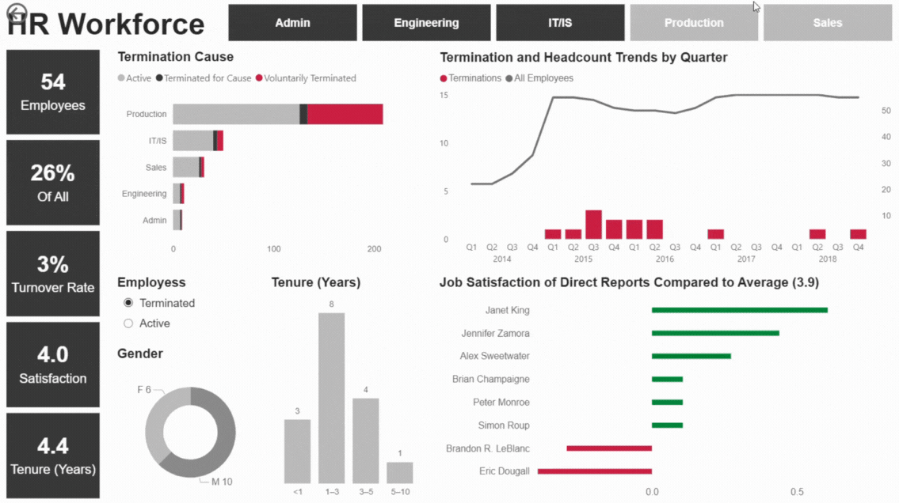

## About Me

I currently work as a General Ledger Functional Specialist at Jacobs Solutions, where I support global finance teams by administering Oracle EPM Cloud systems. Previously, I worked at ABB in the General Accounting department.

I graduated with a Bachelor's Degree in Information Technology and Econometrics from AGH University of Science and Technology, complemented by an Erasmus+ exchange at The Hague University of Applied Sciences. I also hold a Bachelor's Degree in Investment and Business Consulting from the Cracow University of Economics.

## Projects (in progress)

### HR Workforce Dashboard – Power BI

A dynamic HR analytics dashboard built in Power BI.  
Below is a preview of the report:

### More Data Projects Will Be Added Soon

